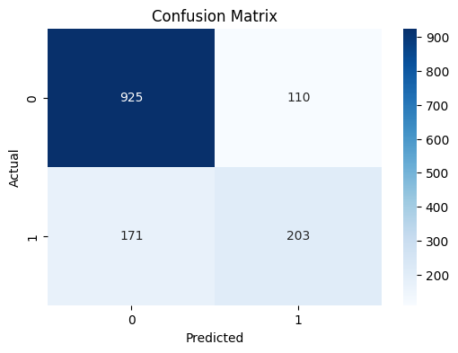
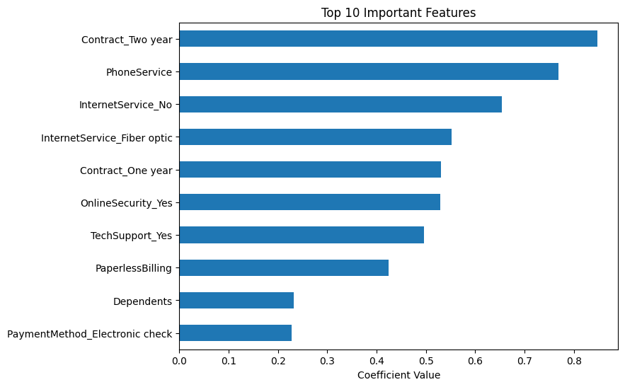

# 🔄 Churn Prediction Model – Machine Learning Project

## 📌 Overview
This project predicts customer churn using a logistic regression model trained on the Telco Customer Churn dataset. It includes data cleaning, preprocessing, model training, evaluation, and visual insights into churn drivers.

---

## 📂 Project Structure

churn-prediction-model/

│

├── data/ # Raw dataset (CSV)

├── notebooks/ # Jupyter notebook for model building

├── images/ # Visualizations (confusion matrix, features, etc.)

└── README.md # This file

---

## 📊 Key Features
- Logistic Regression model to classify churn
- Data cleaning & preprocessing using Pandas
- One-hot and binary encoding of categorical variables
- Feature importance visualization
- Confusion matrix and performance metrics

---

## 🧪 Technologies Used
- Python
- Pandas, NumPy
- Scikit-learn
- Seaborn, Matplotlib
- Jupyter Notebook

---

## 📉 Model Results
- **Accuracy**: ~85% (may vary depending on seed)
- **Confusion Matrix**: Plotted in `/images/`
- **Top Features**: Displayed using model coefficients

---

## 📸 Screenshots

>   
> 

---

## 👤 Author
**Udhva Patel**  
Master’s in Information Technology and Management  
[LinkedIn](https://www.linkedin.com/in/udhva-patel/) • [GitHub](https://github.com/UdhvaPatel) 

